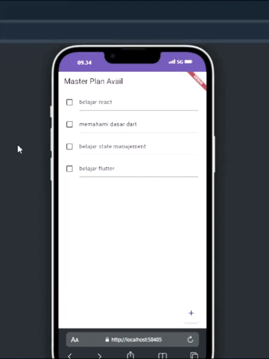

# Tugas Praktikum 1: Dasar State dengan Model-View
# Avail Dwi Febrianto
# 2D TRPL

## Deskripsi Proyek
Aplikasi ini adalah sebuah aplikasi manajemen tugas sederhana yang memungkinkan pengguna untuk:
- Menambah, mengedit, dan menghapus tugas
- Menandai tugas sebagai selesai atau belum selesai
- Mengelola tugas melalui antarmuka yang interaktif

Aplikasi ini dikembangkan menggunakan Flutter dan memiliki fungsi-fungsi dasar untuk manajemen tugas.

## Fitur Utama
- **Tambah Tugas Baru:** Pengguna dapat menambah tugas dengan deskripsi yang mereka inginkan.
- **Edit Tugas:** Mengubah deskripsi tugas atau menandai tugas sebagai selesai/belum.
- **Hapus Tugas:** Menghapus tugas yang tidak diperlukan.
- **Fungsi Scroll:** Mendukung scroll yang halus untuk pengalaman pengguna yang nyaman.

## Tampilan Aplikasi
### Menambah Tugas


### tampilan


- **main.dart**: Berisi logika utama untuk menjalankan aplikasi.
- **home_screen.dart**: Layar utama yang menampilkan daftar tugas.
- **task.dart**: Model untuk tugas.
- **data_layer.dart**: File barrel yang mengatur import model-model.

## Penjelasan Langkah Penting

### Langkah 4: File data_layer.dart
File `data_layer.dart` berfungsi sebagai *barrel file*, yang menyederhanakan proses import berbagai model yang diperlukan. Ini memudahkan pemeliharaan kode dan meningkatkan skalabilitas proyek.

### Langkah 6: Variabel plan
Variabel `plan` adalah konstanta yang digunakan untuk menyimpan state dari daftar tugas. Menggunakan `const` pada variabel ini membantu Flutter melakukan optimasi performa dengan prinsip *immutability*.

### Langkah 9: Komponen ListTile
Di dalam setiap item tugas, terdapat komponen `ListTile` yang berisi:
- **Checkbox:** Untuk menandai status selesai atau belum dari tugas.
- **TextFormField:** Memungkinkan pengguna mengedit deskripsi tugas.

### Langkah 11 dan 13: Lifecycle Methods
- **initState():** Inisialisasi `ScrollController` dan menambahkan listener untuk menghilangkan fokus dari keyboard saat scroll.
- **dispose():** Membersihkan `ScrollController` saat widget dihapus dari widget tree untuk mencegah *memory leak*.

## Cara Menjalankan Aplikasi
1. Pastikan Flutter sudah terpasang di komputer Anda.
2. Clone repository ini: 
   ```bash
   git clone https://github.com/xfbriianto/master-plan
   ```
3. Buka proyek di editor Anda, lalu jalankan dengan perintah:
   ```bash
   flutter run
   ```


# Tugas Praktikum 2: Mengelola Data Layer dengan InheritedWidget dan InheritedNotifier


### tampilan


## Tujuan
Memisahkan data todo list dari class view dan mengelola state aplikasi dengan menggunakan `InheritedWidget` dan `InheritedNotifier`.

## Pertanyaan
**Bagaimana seharusnya Anda mengakses data pada aplikasi?**

### Jawaban
Data sebaiknya diakses dengan memisahkannya dari UI dan mengelolanya dalam data layer yang terpisah. Ini dapat dilakukan dengan menggunakan `InheritedWidget` yang memungkinkan data diteruskan ke sub-widget tanpa harus menjadikannya bagian dari widget tree. `InheritedWidget` bertindak sebagai jembatan antara view dan data layer, memungkinkan komunikasi yang efisien dan terstruktur.

## Langkah-langkah Praktikum

### Langkah 1: Buat File `plan_provider.dart`
- Buat folder `provider` di dalam folder `lib`.
- Buat file `plan_provider.dart` dengan kode berikut:
  ````dart
  import 'package:flutter/material.dart';
  import '../models/data_layer.dart';

  class PlanProvider extends InheritedNotifier<ValueNotifier<Plan>> {
    const PlanProvider({
      super.key,
      required Widget child,
      required ValueNotifier<Plan> notifier,
    }) : super(child: child, notifier: notifier);

    static ValueNotifier<Plan> of(BuildContext context) {
      return context.dependOnInheritedWidgetOfExactType<PlanProvider>()!.notifier!;
    }
  }
  ````

### Langkah 2: Edit `main.dart`
- Ganti atribut `home` dengan `PlanProvider`:
  ````dart
  return MaterialApp(
    theme: ThemeData(primarySwatch: Colors.purple),
    home: PlanProvider(
      notifier: ValueNotifier<Plan>(const Plan()),
      child: const PlanScreen(),
    ),
  );
  ````

### Langkah 3: Tambah Method pada Model `plan.dart`
- Tambahkan method berikut:
  ````dart
  int get completedCount => tasks.where((task) => task.complete).length;
  String get completenessMessage => '$completedCount out of ${tasks.length} tasks';
  ````

### Langkah 4: Pindah ke `PlanScreen`
- Edit `PlanScreen` untuk menggunakan data dari `PlanProvider`.

### Langkah 5: Edit Method `_buildAddTaskButton`
- Tambahkan `BuildContext` sebagai parameter:
  ````dart
  Widget _buildAddTaskButton(BuildContext context) {
    ValueNotifier<Plan> planNotifier = PlanProvider.of(context);
    return FloatingActionButton(
      child: const Icon(Icons.add),
      onPressed: () {
        Plan currentPlan = planNotifier.value;
        planNotifier.value = Plan(
          name: currentPlan.name,
          tasks: List<Task>.from(currentPlan.tasks)..add(const Task()),
        );
      },
    );
  }
  ````

### Langkah 6: Edit Method `_buildTaskTile`
- Tambahkan `BuildContext` dan gunakan `PlanProvider`:
  ````dart
  Widget _buildTaskTile(Task task, int index, BuildContext context) {
    ValueNotifier<Plan> planNotifier = PlanProvider.of(context);
    return ListTile(
      leading: Checkbox(
        value: task.complete,
        onChanged: (selected) {
          Plan currentPlan = planNotifier.value;
          planNotifier.value = Plan(
            name: currentPlan.name,
            tasks: List<Task>.from(currentPlan.tasks)
              ..[index] = Task(
                description: task.description,
                complete: selected ?? false,
              ),
          );
        }),
      title: TextFormField(
        initialValue: task.description,
        onChanged: (text) {
          Plan currentPlan = planNotifier.value;
          planNotifier.value = Plan(
            name: currentPlan.name,
            tasks: List<Task>.from(currentPlan.tasks)
              ..[index] = Task(
                description: text,
                complete: task.complete,
              ),
          );
        },
      ),
    );
  }
  ````

### Langkah 7: Edit `_buildList`
- Sesuaikan parameter:
  ````dart
  Widget _buildList(Plan plan) {
    return ListView.builder(
      controller: scrollController,
      itemCount: plan.tasks.length,
      itemBuilder: (context, index) =>
        _buildTaskTile(plan.tasks[index], index, context),
    );
  }
  ````

### Langkah 8: Tetap di Class `PlanScreen`
- Edit method `build` untuk menampilkan progress di bagian bawah.

### Langkah 9: Tambah Widget `SafeArea`
- Tambahkan widget `SafeArea`:
  ````dart
  @override
  Widget build(BuildContext context) {
    return Scaffold(
      appBar: AppBar(title: const Text('Master Plan')),
      body: ValueListenableBuilder<Plan>(
        valueListenable: PlanProvider.of(context),
        builder: (context, plan, child) {
          return Column(
            children: [
              Expanded(child: _buildList(plan)),
              SafeArea(child: Text(plan.completenessMessage))
            ],
          );
        },
      ),
      floatingActionButton: _buildAddTaskButton(context),
    );
  }
  ````

## Menjalankan Aplikasi
1. Pastikan Flutter sudah terpasang di komputer Anda.
2. Clone repository ini:
   ```bash
   git clone https://github.com/xfbriianto/master-plan
   ```
3. Buka proyek di editor Anda, lalu jalankan dengan perintah:
   ```bash
   flutter run
   ```


## Deskripsi
Pada praktikum ini, kita mempelajari cara mengelola state pada aplikasi Flutter yang terdiri dari beberapa layar (multiple screens). State di setiap layar akan dikelola dan disinkronkan agar aplikasi dapat berfungsi sesuai tujuan.

## Hasil Akhir
Berikut ini adalah tampilan hasil akhir aplikasi setelah mengikuti langkah-langkah di praktikum ini.


---

## Langkah-Langkah Praktikum

1. **Persiapan dan Pembuatan Folder**  
   Buatlah struktur folder aplikasi sesuai kebutuhan proyek. Pastikan sudah tersedia file utama untuk tiap-tiap layar yang akan ditampilkan.

2. **Pengelolaan State dengan InheritedWidget/InheritedNotifier**  
   Gunakan `InheritedWidget` atau `InheritedNotifier` untuk memastikan data dapat diakses dan dibagikan di antara beberapa layar. Pastikan data state utama diletakkan di provider agar bisa dibagikan ke seluruh widget yang membutuhkannya.

3. **Menambahkan Navigasi Antar Layar**  
   Tambahkan navigasi antar layar menggunakan `Navigator.push` dan `Navigator.pop`. Pastikan state pada layar tujuan diperbarui sesuai dengan data yang dibawa dari layar sebelumnya.

4. **Implementasi Fitur Utama**  
   Implementasikan fungsi-fungsi utama sesuai instruksi praktikum, seperti menambah, mengedit, atau menghapus data. Pastikan setiap perubahan state di satu layar dapat terlihat dan tercermin di layar lainnya.

5. **Pengujian dan Debugging**  
   Setelah implementasi selesai, lakukan pengujian. Perbaiki error yang ditemukan, seperti error yang mungkin terjadi saat sinkronisasi state antar layar atau ketika data tidak ter-update.

---

Berikut adalah contoh README.md berdasarkan penjelasan diagram yang diberikan:

---

# Praktikum Flutter: Navigasi Antar Halaman & Struktur Widget

## Deskripsi
Pada praktikum ini, kita mempelajari bagaimana cara kerja navigasi antar halaman di aplikasi Flutter dan bagaimana struktur widget berubah ketika kita berpindah dari satu halaman ke halaman lain. Diagram di bawah ini menjelaskan alur navigasi serta perubahan struktur widget dari layar awal ke layar tujuan.

## Diagram Navigasi dan Struktur Widget

### Penjelasan

#### Bagian Kiri - Sebelum Pindah Halaman
1. **MaterialApp**  
   MaterialApp adalah root dari aplikasi Flutter kita. Ini berfungsi sebagai wadah utama yang mencakup semua komponen aplikasi.

2. **PlanProvider**  
   PlanProvider digunakan untuk menyimpan data penting yang akan dipakai di halaman berikutnya. Dengan menggunakan `PlanProvider`, kita bisa membuat data bisa diakses dan di-share di antara berbagai halaman.

3. **PlanCreatorScreen**  
   Ini adalah halaman pertama yang muncul, tempat kita bisa membuat rencana atau tugas baru. Halaman ini berisi elemen-elemen berikut:
   - **TextField**: Tempat untuk menulis deskripsi tugas.
   - **Expanded** dengan **ListView**: Menampilkan daftar tugas yang sudah dibuat. `Expanded` digunakan agar tampilan ListView bisa menyesuaikan ukuran layar.

   **Intinya**: Tampilan pertama ini adalah halaman di mana kita dapat menambah tugas atau rencana baru.

#### Bagian Kanan - Setelah Pindah Halaman dengan Navigator Push
1. **PlanScreen**  
   Setelah menekan tombol untuk navigasi (`Navigator.push`), kita akan masuk ke halaman baru bernama `PlanScreen`. Halaman ini memiliki beberapa elemen:

   - **Scaffold**: Struktur dasar tampilan halaman, yang memiliki AppBar dan body.
   - **Column**: Menampung komponen-komponen di dalamnya.
     - **Expanded** dengan **ListView**: Menampilkan daftar tugas yang telah dibuat, dengan ukuran yang menyesuaikan layar.
     - **SafeArea**: Mencegah teks di bawahnya tertutup oleh batas layar atau tombol navigasi.
     - **Text**: Menampilkan status atau jumlah tugas yang telah diselesaikan.

   **Intinya**: Setelah navigasi ke halaman ini, kita bisa melihat daftar tugas dan progres atau status dari tugas yang sudah diselesaikan, membuat pengalaman pengguna lebih jelas dan informatif.

### Kesimpulan
Diagram ini menunjukkan bagaimana kita dapat berpindah dari halaman input tugas ke halaman daftar tugas, sekaligus memperlihatkan perubahan struktur widget setelah berpindah halaman. Dengan tampilan yang lebih terstruktur pada halaman kedua, pengguna bisa melihat daftar tugas dan progresnya dengan lebih jelas, sehingga pengalaman pengguna menjadi lebih nyaman dan terarah.

---

Dengan penjelasan di atas, pengguna dapat memahami bagaimana alur dan struktur widget dikelola di aplikasi ini. Diagram ini membantu dalam memahami perbedaan antara halaman awal dan halaman setelah navigasi, serta pentingnya `PlanProvider` untuk sinkronisasi data di seluruh halaman.

---

---

## Pengumpulan Laporan

Laporan praktikum ini telah selesai dan didokumentasikan di dalam repository GitHub. Link repository atau commit dapat ditemukan [di sini](link-ke-repo).

---

**Catatan:** Pastikan setiap bagian sudah ditambahkan sesuai kebutuhan, dan semua link di atas telah disesuaikan dengan link yang valid di repo GitHub Anda.

